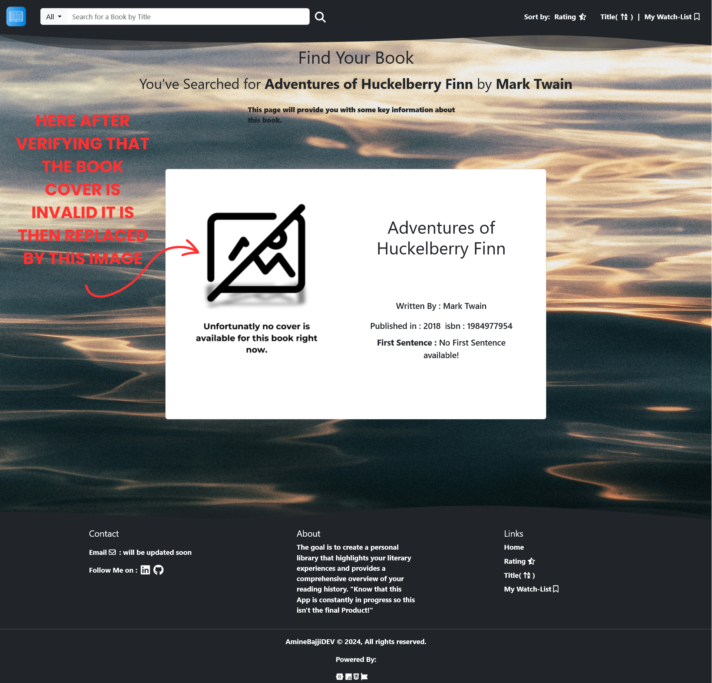

# BookNotes App 📚 Hosted Live on Render.com!

This is a web app where users can search for books, retrieve information via the Open Library API, and they can also manage their personal book collection. It allows users to view their "already read" books with their opinion and order them by rating, title, or genre, and explore books from their watchlist. The app also fetches information about each book, such as its cover image, author, isbn, publishing date, title and genre using the Open Library API.


## Features

- **Search for books** using the Open Library API
- **Retrieve book information** such as title, author, first published year, genre, and more
- **Manage book collections**, including books read, books on watchlist, and display books by genre
- **Order books** by title, rating, and genre
- **Check book cover images**, automatically detecting invalid covers
- **Submit and view personal opinions** on read books

## Technologies Used

- **Node.js** and **Express.js**: Backend framework for handling API requests
- **PostgreSQL**: For storing user’s book information and opinions
- **EJS**: Templating engine to dynamically render pages
- **Axios**: HTTP client to interact with external APIs (Open Library)
- **Image-Pixels**: To verify if book cover images are valid
- **Body-parser**: To handle form data

## Installation

1. **Clone the repository:**
   ```bash
   git clone https://github.com/AminebajjiDEV/booknotes-app.git
   cd booknotes-app
   
2. **Install the dependencies:**
   ```bash
   npm install
   
3. **Set up PostgreSQL database:** Create a PostgreSQL database(using Pgadmin for example) and configure it with the following environment variables in a .env file:  
    ```bash
    DB_USER=your_db_username
    DB_HOST=your_db_host
    DB_NAME=your_db_name
    DB_PASSWORD=your_db_password
    DB_PORT=your_db_port
    PORT=3000
4. **Run the server:**
    ```bash
    npm index.js

5. **Access the application:**
    ```bash
   Open your browser and go to http://localhost:3000.

## Environment Variables for the PostgreSQL database
  The project uses the following environment variables:
  | Variable  | Description |
  | ------------- | ------------- |
  | DB_USER  | PostgreSQL database username  |
  | DB_HOST  | PostgreSQL database host  |
  | DB_NAME  | PostgreSQL database name  |
  | DB_PASSWORD  | 	PostgreSQL database password  |
  | DB_PORT  | PostgreSQL database port  |
  | PORT  | Port on which the app runs  |
  
## Database Structure
The PostgreSQL database should have the following schema for storing book information:
  ```bash
  CREATE TABLE books (
      id SERIAL PRIMARY KEY,
      title VARCHAR(255) NOT NULL,
      author VARCHAR(255) NOT NULL,
      rating INT CHECK (rating >= 0 AND rating <= 5),
      read_at DATE,
      genre VARCHAR(255),
      isbn VARCHAR(20),
      is_read BOOLEAN DEFAULT FALSE,
      is_in_watchlist BOOLEAN DEFAULT FALSE,
      opinion TEXT );
  ```

  ## Endponits
  - **GET /:** Display books that the user has read, ordered by the most recent read date
  - **GET /byRating:** Display read books ordered by rating in descending order
  - **GET /byTitle:** Display read books ordered by title in alphabetical order
  - **GET /byWatchList:** Display books on the user's watchlist
  - **GET /genre?genre=<genre>:** Display books by a specific genre
  - **GET /opinion?id=<book_id>:** Display a user's opinion on a specific book
  - **POST /search:** Search for books via the Open Library API and display book details

  ## App Usage
  - **Search for a Book:** Use the search form on the homepage to find information about a book by its title.  
  - **Check Book Cover:** The app automatically checks for the existence of a valid cover image and provides a fallback if no image is found.
  - **View Book Info:** After searching, view detailed information about the book, including author, publication year, and genre.
  - **Personal Book Collection:** Browse your personal collection of read books and books in your watchlist.
  - **Sort Books:** View your books by rating, title, or genre.
  - **User Opinions:** View personal opinions on books from your collection.
    
    ### App Usage screenshots:
    - **Sort by Genre** :


  ## Issues and Resolutions
  ### Book Cover Image Issue
  When a user searchs for a book via the Open Library API, sometimes the image returned for some book covers is less than 1 pixel in width & height, which results in white space on the search results. To resolve this issue i encountered, I used the image-pixels library to check the dimensions of the returned image on the server side before renedering the results. If the image's size is less than 100px, I replace it with a local image that says "No Image Available" instead of leaving an empty white space.
**Solution Steps:**
1. **Fetch the image URL returned by the Open Library API.**
2. **Using image-pixels to analyze the image's size.**
3. **If the image is less than 100px in width or height, replace it with a locally stored image that indicates "no image is available".**
4. **This ensures the search results remain visually consistent without having unecessary white spaces.**
Here is a code snippet that handles this:
  ```bash
  // to verify if book cover image exists 
  async function checkImageUrl(isbn){

    const imageUrl = `https://covers.openlibrary.org/b/isbn/${isbn}-L.jpg`;
    const fallbackImage = 'images/image.png';
    const { width , height } = await pixels(imageUrl); // return width,height in PX
    if(width < 100){
        return fallbackImage;
    }
    return imageUrl
    
    }
   ```
**This ensures a fallback image is displayed when the Open Library API returns an invalide cover image.**

**Screenshot:**



## Acknowledgments

the following resources helped in the development of this project:

   - **npm:** For providing essential packages such as image-pixels for verifying the book cover image size.

   - **Stack Overflow:** For the amazing comunity that helped me find a solution that guided me when resolving the book cover image size issue.

   - **W3Schools:** For providing clear and comprehensive resources on SQL queries, which helped me implement efficient database interactions with PostgreSQL.

Thank you all!

## License

This project is licensed under the MIT License - see the LICENSE file for details.
